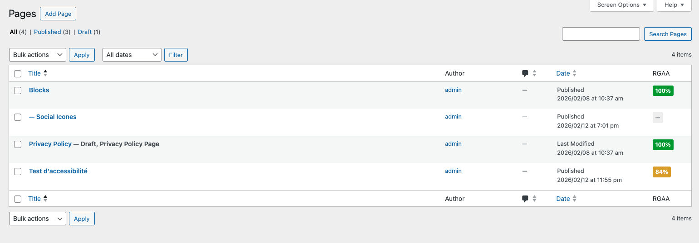
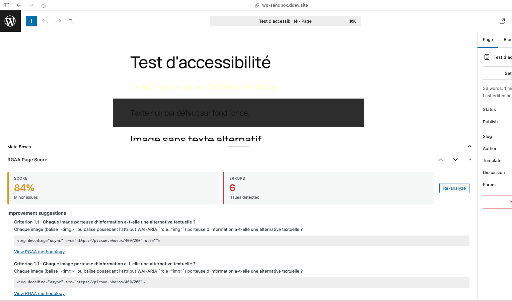

# RGAA Page Score

> **Version expérimentale** — Ce plugin est encore en développement actif. Les fonctionnalités peuvent évoluer et des bugs peuvent subsister.

Plugin WordPress affichant un score d'accessibilité RGAA dans la liste des pages et une meta box dans l'éditeur avec les pistes d'amélioration.




## Objectif

RGAA Page Score vise à aider les éditeurs et développeurs à améliorer l'accessibilité de leurs contenus WordPress en :

- **Donnant une visibilité immédiate** sur le niveau de conformité RGAA de chaque page ou article
- **Accompagnant la correction** en listant les problèmes détectés avec des liens vers la méthodologie officielle
- **Automatisant une partie des tests** du référentiel RGAA 4.1 (images, liens, formulaires, structure des titres, tableaux, contrastes, etc.)

Le score est calculé uniquement sur les tests automatisables. Certains critères RGAA nécessitent une vérification humaine et ne sont pas pris en compte dans le calcul.

## Fonctionnement

1. **Analyse automatique** : À chaque enregistrement d'un article ou d'une page, le plugin analyse le contenu HTML rendu et exécute une série de tests conformes au référentiel RGAA 4.1.
2. **Analyse à la demande** : Un bouton « Analyser » dans la meta box permet de relancer l'analyse sans republier.
3. **Score et issues** : Le résultat affiche un pourcentage (0–100 %) et la liste des non-conformités détectées, avec le critère RGAA concerné et un lien vers la méthodologie officielle.
4. **Colonne dans la liste** : La liste des articles et pages affiche une colonne RGAA avec une pastille colorée (vert / orange / rouge) selon le score.

Les données du référentiel (critères, tests, méthodologie) proviennent du dépôt officiel de la DISIC.

## Roadmap

### Fonctionnalités actuelles

- [ ] Score RGAA dans la meta box de l’éditeur
- [ ] Colonne RGAA dans la liste des articles et pages
- [ ] Analyse automatique à l’enregistrement
- [ ] Analyse à la demande (bouton « Analyser »)
- [ ] Tests automatisés : images, liens, formulaires, structure des titres, tableaux, contrastes, cadres, navigation
- [ ] Liens vers la méthodologie officielle pour chaque issue

### À venir

- [ ] Page de paramètres (types de contenus, activation/désactivation des tests)
- [ ] Extension aux types de contenus personnalisés (CPT)
- [ ] Tests supplémentaires (scripts, médias, formulaires avancés)
- [ ] Tri et filtrage par score dans la liste des contenus
- [ ] Rapport d’accessibilité exportable (PDF ou HTML)
- [ ] Première version stable

## Données RGAA

Les fichiers JSON proviennent du dépôt officiel [DISIC/accessibilite.numerique.gouv.fr](https://github.com/DISIC/accessibilite.numerique.gouv.fr).

## Architecture des tests

| Fichier                        | Rôle                                                                                    |
| ------------------------------ | --------------------------------------------------------------------------------------- |
| `class-rgaa-scanner.php`       | Orchestration : charge le HTML, exécute les tests, calcule le score                     |
| `class-rgaa-test-base.php`     | Classe de base : `build_issue()`, `run_elements_test()`                                 |
| `class-rgaa-test-helpers.php`  | Utilitaires : `has_alternative_text()`, `is_decorative()`, `has_ancestor_with()`        |
| `tests/class-rgaa-tests-*.php` | Tests par domaine (Images, Cadres, Tableaux, Liens, Formulaires, Structure, Navigation) |

## Fichiers

| Fichier               | Source                      | Description                               |
| --------------------- | --------------------------- | ----------------------------------------- |
| `criteres.json`       | RGAA/4.1/criteres.json      | Critères et tests du référentiel RGAA 4.1 |
| `methodologies.json`  | RGAA/4.1/methodologies.json | Méthodologie détaillée pour chaque test   |
| `glossaire.json`      | RGAA/4.1/glossaire.json     | Définitions des termes RGAA               |
| `tests-registry.json` | Plugin                      | Configuration des tests automatisables    |

## tests-registry.json

Le registre associe les identifiants de tests officiels (ex: `1.1.1`, `6.1.1`) aux handlers PHP du plugin.

**Source de vérité** : L'ordre d'exécution des tests suit la structure de `criteres.json`. Le scanner parcourt les 258 tests du référentiel et n'exécute que ceux pour lesquels un handler est défini dans le registre.

Pour ajouter un nouveau test automatisable :

1. Ajouter une entrée dans `automatable_tests` de `tests-registry.json` (ex: `"7.1.1": {"handler": "scripts_alt", "selector": "script"}`)
2. Créer ou modifier une classe dans `includes/tests/` (ex: `class-rgaa-tests-scripts.php`)
3. Implémenter la méthode de test en étendant `RGAA\Score\Test_Base` et en utilisant `run_elements_test()` ou les helpers
4. Enregistrer le handler via `get_handlers()` et ajouter la classe dans `RGAA\Score\Scanner::$test_classes` (ou `Scanner::register_test_class()`)
5. Charger le fichier dans `rgaa-page-score.php`

Les titres et descriptions des issues proviennent de `criteres.json` lorsque disponibles.

## Mise à jour des données

Pour mettre à jour les critères RGAA avec une nouvelle version (à exécuter depuis la racine du plugin) :

```bash
curl -sL "https://raw.githubusercontent.com/DISIC/accessibilite.numerique.gouv.fr/main/RGAA/4.1/criteres.json" -o data/criteres.json
curl -sL "https://raw.githubusercontent.com/DISIC/accessibilite.numerique.gouv.fr/main/RGAA/4.1/methodologies.json" -o data/methodologies.json
curl -sL "https://raw.githubusercontent.com/DISIC/accessibilite.numerique.gouv.fr/main/RGAA/4.1/glossaire.json" -o data/glossaire.json
```
